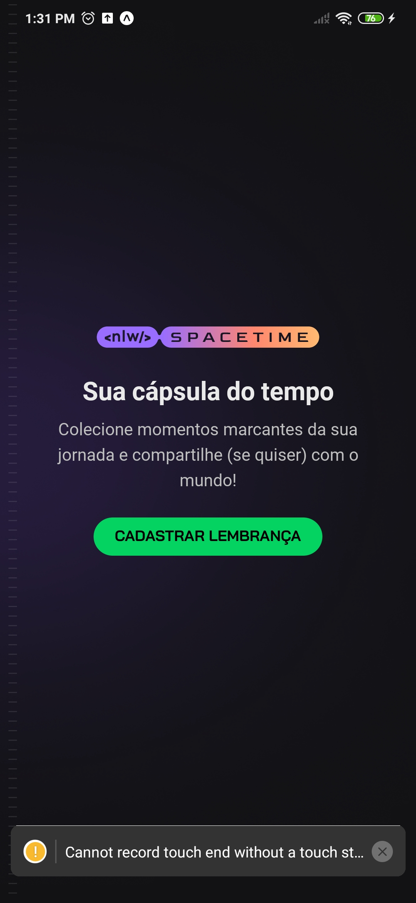
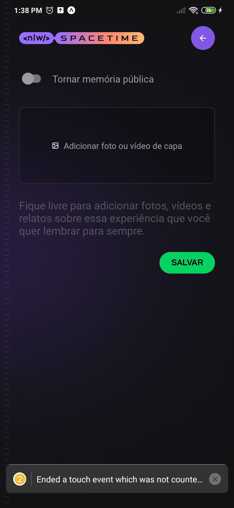
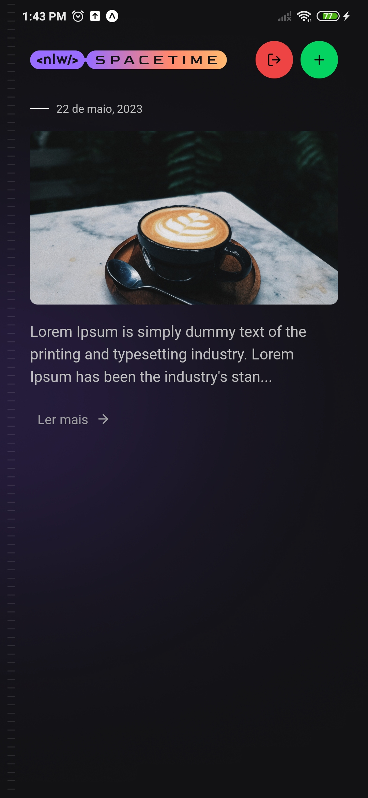

### NLW Spacetime - Mobile

Aplicação Mobile desenvolvida durante NLW (Next Level Week) da Rocketseat que tem como objetivo ser a interface mobile de uma aplicação para guardar memórias (Texto, imagens, etc.) A interface consome API Rest também criada durante a semana.

O sistema foi desenvolvido com o framework utilizando React Native com Typescript e Expo e estilizado com a biblioteca TailwindCSS. Também foi trabalhado o coceito de manipulação de datas e autenticação do mobile com o back-end utilizando login com GitHub e token guardado no Secure Store, do Expo.

### Algumas imagens da interface mobile abaixo:

#### Interface inicial

#### Criação de memórias

#### Página de listagem de memórias


### Para executar o projeto basta seguir as instruções abaixo

Lembrando que é possível rodar o projeto mobile por emulador (Android, IOS) ou em seu próprio aparelho.

Antes de tudo, verifique se há alguma versão do Node instalada rodando o comando:

```bash
node --version
```
O comando deverá retornar a versão do Node instalada. Se não houver, baixe-a

Caso o Node esteja instalado, entre na pasta do projeto e rode o seguinte comando para instalar todas as dependências:

```bash
npm install
```
Em seguida, rode o seguinte comando para rodar o projeto:

Caso queira rodar no próprio celular, vá em configurações e habilite as "opções de desenvolvedor" e lá, habilite a depuração via USB, em seguida, baixe o app do Expo Go, conecte o cabo USB do celular para o computador, digite o comando abaixo e leia o QR Code informado no terminal, o projeto iniciará automaticamente.

```bash
npm run start
```
Uma mensagem será exibida no terminal informando como proseguir para visualizar o projeto. Isso dependerá de qual tecnologia estiver usando, se for emulador (Android ou IOS) a mensagem informará a tecla a ser clicada para iniciar o emulador automaticamente (caso seu emulador esteja instalado). Também informará um QR Code para leitura caso queira executar no próprio aparelho móvel.